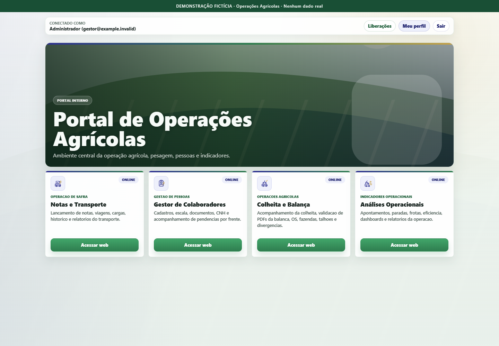
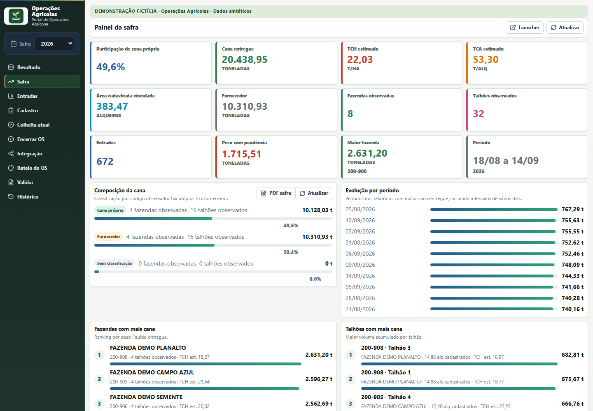

# Operações Agrícolas

Uma suíte integrada para acompanhar a rotina agrícola: colheita, pesagem, transporte, colaboradores e indicadores operacionais.

**Projeto de portfólio com demonstração funcional e dados inteiramente fictícios.** Os números, pessoas, propriedades, frotas e movimentações apresentados não representam uma operação real. Esta distribuição não contém módulo de mapas.



## O projeto em um minuto

O sistema conecta o trabalho administrativo ao acompanhamento da operação. Um único portal autentica o usuário e reúne quatro aplicações, mantendo suas regras, interfaces, bancos, relatórios e integrações.

| Módulo | O que é possível explorar |
| --- | --- |
| Colheita e Balança | Fazendas e talhões, ordens de serviço, liberações e encerramentos, importação de pesagens, divergências, rateio, frota e fechamento de safra. |
| Notas e Transporte | Lançamentos, proteção do histórico, cadastros, integração com colaboradores e Balança, rankings e relatórios PDF/Excel. |
| Colaboradores | Cadastro e consulta, escala, acompanhamento de CNH, pendências documentais e relatórios. |
| Análises Operacionais | Apontamentos, paradas, motivos, eficiência por turno e frente, colheita e exportações. |
| Portal | Login compartilhado, permissões, auditoria, navegação e acompanhamento da disponibilidade dos módulos. |

Não é uma coleção de telas estáticas: os backends persistem as alterações em PostgreSQL, as APIs respondem aos filtros e as exportações são produzidas pelo código da aplicação.

## Cenário demonstrativo

Imagine uma organização fictícia acompanhando quatro frentes de trabalho durante uma safra. A equipe cadastra propriedades, libera talhões, confere pesagens, registra viagens e acompanha disponibilidade de pessoas e equipamentos.

O primeiro preparo gera:

- 8 fazendas, 32 talhões e 8 ordens de serviço;
- 672 registros de pesagem, incluindo divergências deliberadas para investigação;
- 32 colaboradores fictícios, com diferentes situações de CNH;
- 84 notas de transporte;
- 112 apontamentos de parada e 112 registros de colheita;
- uma base fictícia de frotas e um CSV de exemplo para importação.

As datas são relativas ao primeiro preparo. Os indicadores são calculados a partir desse cenário: não são resultados de negócio atribuídos a clientes.



## Executar localmente

Ambiente validado: **Windows, Python 3.12, Node.js 22, npm 11 e PostgreSQL 17**. Instale esses pré-requisitos antes de continuar. Não é necessário criar um serviço PostgreSQL para a demonstração: o controlador cria seu próprio cluster local.

```powershell
git clone https://github.com/gabrisantoss/operacoes-agricolas.git
cd operacoes-agricolas
py -3.12 demo.py setup
py -3.12 demo.py credentials
py -3.12 demo.py start --open
```

O portal abre em **http://127.0.0.1:8890**. O usuário é `gestor@example.invalid`; a senha é gerada localmente e exibida pelo comando `credentials`. A instalação inicial precisa de internet para baixar dependências. O uso demonstrativo normal é local.

Se os executáveis estiverem fora dos caminhos usuais, configure antes do primeiro `setup`:

```powershell
$env:OA_DEMO_NODE = 'C:\caminho\node.exe'
$env:OA_DEMO_POSTGRES_BIN = 'C:\Program Files\PostgreSQL\17\bin'
```

O preparo instala dependências em `.demo/venv`, compila os workspaces TypeScript, aplica migrações e cria o cenário fictício. A configuração local fica em `.demo/runtime.json`, ignorada pelo Git. A sincronização autenticada Balança → Notas é executada na inicialização.

Depois do preparo, o arquivo `INICIAR DEMONSTRACAO.cmd` também abre a suíte. Mantenha o terminal aberto. **Ctrl+C** encerra os cinco servidores; para encerrar o banco dedicado, execute:

```powershell
py -3.12 demo.py stop-db
```

Nenhum serviço do Windows, tarefa agendada ou regra de firewall é instalado. Portas ocupadas interrompem a inicialização; o controlador não reaproveita processos de outra instalação.

## Roteiro para conhecer a aplicação

1. Entre no portal e abra **Colheita e Balança → Safra**. Compare propriedades, talhões e volume conferido.
2. Explore **Ordens de Serviço** e os vínculos entre fazenda, talhões e frentes.
3. Consulte divergências de pesagem e a base de frotas. Experimente os relatórios.
4. Em **Notas e Transporte**, consulte o histórico e o BI. Cadastros de fazendas/talhões e referências de colaboradores são integrados.
5. Em **Colaboradores**, veja as situações fictícias de CNH e os filtros da fila de acompanhamento.
6. Em **Análises**, filtre os apontamentos e compare horas paradas, motivos e eficiência por turno.

Mais contexto em [apresentação do projeto](docs/APRESENTACAO.md) e [arquitetura](docs/ARQUITETURA.md).

## Engenharia e validação

Python/PyQt5 nas aplicações administrativas; React/TypeScript na Balança; Express nas APIs; PostgreSQL como persistência demonstrativa. Os relatórios preservam os mecanismos próprios de cada aplicação, incluindo ReportLab, FPDF2, PDFKit e exportações Excel.

```powershell
py -3.12 demo.py test
cd balanca-audit
npm.cmd run build
npm.cmd audit
```

O comando `test` usa um banco de testes separado e executa os testes Python em processos independentes por arquivo, evitando interferência entre instâncias nativas do Qt. As verificações PostgreSQL não são substituídas por mocks. Consulte [o registro de validação e suas limitações](docs/VALIDACAO.md).

## Limites desta distribuição

- Preserva a estrutura e os principais fluxos do sistema; não é uma cópia de infraestrutura ou de bases operacionais.
- Identidade visual neutra, dados sintéticos e histórico Git novo.
- Sem mapas, georreferenciamento, documentos geográficos, sincronizações de localização ou seus endpoints.
- Sem credenciais de produção, bancos preexistentes, backups, documentos pessoais ou integrações externas ativas.
- Execução local de portfólio; **não deve ser exposta diretamente à internet nem receber dados pessoais reais**.
- Interfaces PyQt e o invólucro Electron permanecem no código. O caminho demonstrativo validado é o portal web; empacotamento de instaladores e execução gráfica Electron não foram validados.
- Extração OCR e provedores de IA opcionais não foram configurados. Importações e relatórios locais preservam seus mecanismos próprios; nenhuma chave externa é fornecida.

Leia também a [política de segurança e privacidade](SECURITY.md).

Desenvolvido por **Gabriel Barbosa dos Santos** · [GitHub](https://github.com/gabrisantoss)
