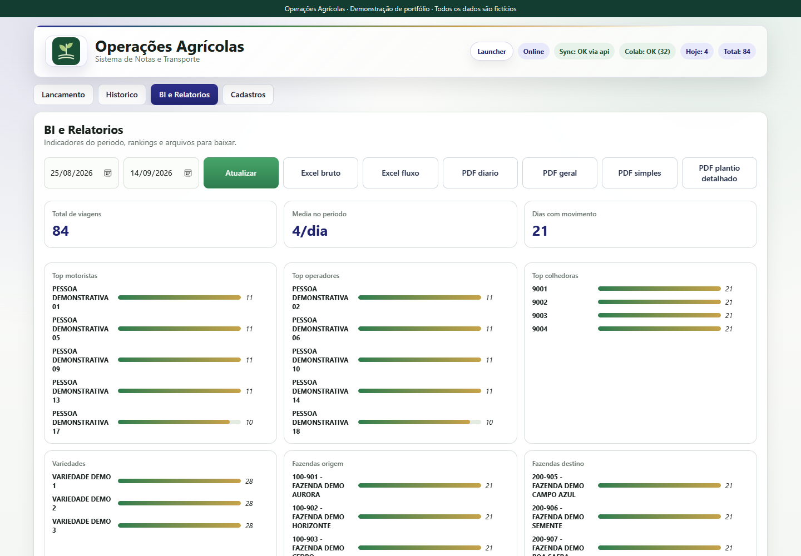
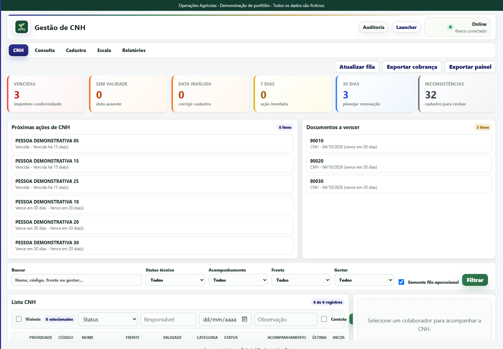
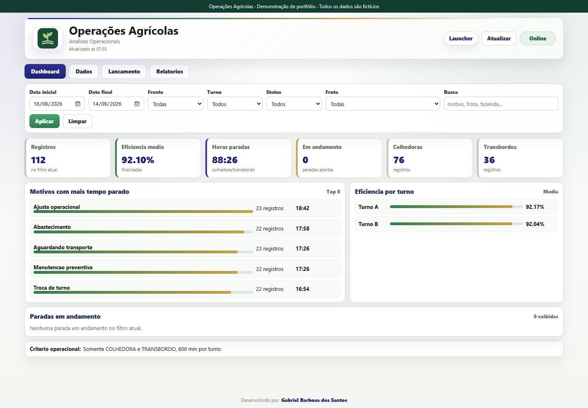

# Apresentação do projeto

## Contexto fictício

Uma equipe agrícola precisa acompanhar, no mesmo dia, liberações de colheita, pesagens recebidas, viagens de transporte, situação dos colaboradores e paradas dos equipamentos. A informação se distribui entre diferentes rotinas, mas as decisões dependem de uma visão consistente.

**Operações Agrícolas** apresenta esse problema em um cenário demonstrativo, usando aplicações integradas e dados produzidos por um gerador local. Não identifica clientes nem apresenta informações de uma empresa real.

## Como a suíte responde

O portal centraliza o acesso. A Balança mantém os cadastros de propriedades e talhões, as ordens de serviço e a conferência da produção. Notas reutiliza os cadastros mestres e consulta as referências de colaboradores. O módulo de pessoas organiza documentação e acompanhamento de CNH. Análises transforma apontamentos em indicadores e relatórios.

| Necessidade | Comportamento demonstrado |
| --- | --- |
| Conferir o que foi recebido | Pesagens vinculadas a fazendas, talhões e ordens, com classificação de divergências. |
| Manter histórico confiável | Proteções contra sobrescrita, auditoria, prévias de correção e registros de alterações. |
| Reduzir recadastro | Sincronização autenticada de propriedades/talhões e consulta de colaboradores. |
| Acompanhar a rotina | Filtragem por período, frente e turno; rankings e painéis específicos por área. |
| Compartilhar uma análise | Geração real de arquivos PDF e Excel a partir da base demonstrativa. |

## Telas da aplicação

### Notas e Transporte

Visão do período, rankings e exportações, com ligação aos cadastros dos outros módulos.

### Colaboradores

Fila de pendências com pessoas demonstrativas. Nenhum documento pessoal ou número de identificação real acompanha o projeto.

### Análises Operacionais

Apontamentos de paradas, motivos e eficiência. Os valores mostrados resultam do gerador de dados e não representam desempenho real.

## O que este portfólio evidencia

- Integração entre aplicações e tecnologias diferentes, com autenticação compartilhada.
- Modelagem de relações entre ordens, propriedades, talhões e movimentações.
- Persistência, migrações, histórico, controles de acesso e validação de entradas.
- Produção de relatórios e tratamento de fluxos de importação.
- Adaptação de uma base extensa para uma demonstração isolada, reproduzível e sem informações operacionais.

## Próximas melhorias técnicas possíveis

Como evolução do produto: dividir componentes de interface extensos, ampliar testes de ponta a ponta no CI, padronizar contratos de erro e telemetria entre os serviços, e empacotar a instalação multiplataforma. São oportunidades futuras, não funcionalidades já concluídas.
